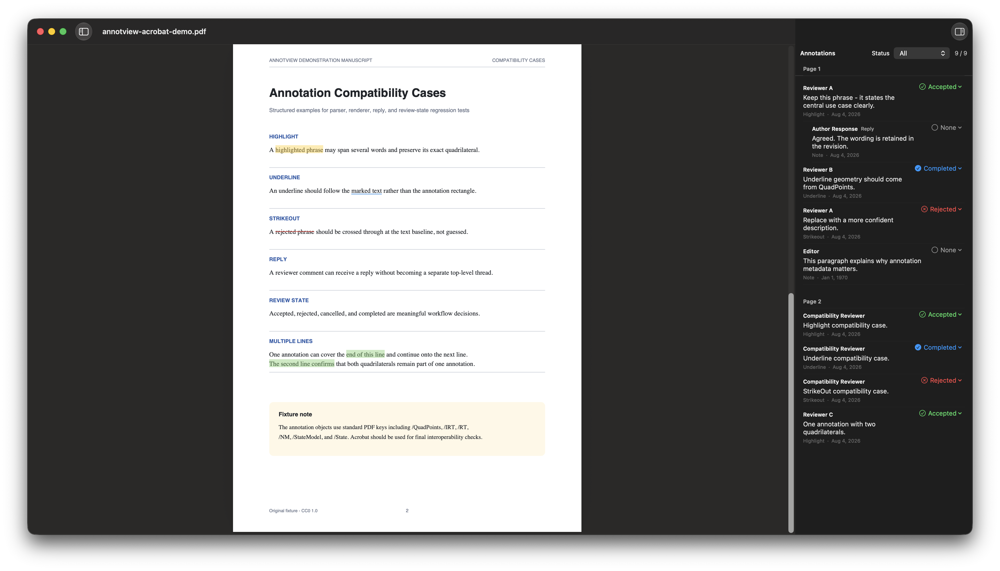

# AnnotView

AnnotView is a lightweight native macOS PDF reader for reviewing Adobe Acrobat annotations.



## Why I built it

I built AnnotView for my own workflow: my advisor reviews papers in Adobe Acrobat, while I only need a fast way to read the annotations and work through the comments. Acrobat feels too heavy for that, and Preview does not always render Acrobat text markup correctly. AnnotView is a small, focused reader—not a full PDF editor.

Built with SwiftUI, AppKit, and PDFKit, AnnotView focuses on reading papers and processing review comments. It uses MuPDF to handle Acrobat annotations more reliably, including text markup positioned with `QuadPoints`.

## Features

- Renders highlights, underlines, strikeouts, text notes, and Insert-Text carets.
- Shows annotation authors, dates, comments, replies, and colors.
- Creates and edits Acrobat-compatible highlights, underlines, strikethroughs, sticky notes, and insert-text markers.
- Supports Acrobat review states: Accepted, Rejected, Cancelled, and Completed.
- Provides comment copying, annotation navigation, and document search.
- Ships an `annotool` CLI for reading and writing Acrobat annotations from a terminal or AI agent.

## Requirements

- macOS 26 or later
- MuPDF `mutool`

Install MuPDF with Homebrew:

```sh
brew install mupdf
```

AnnotView looks for `mutool` in `MUTOOL_PATH`, the app bundle, common Homebrew locations, and `PATH`.

## Install a release

Download the macOS ZIP from Releases, unzip it, and move `AnnotView.app` to Applications. The app is ad-hoc signed, so macOS may block its first launch. Control-click the app and choose **Open**, or allow it in **System Settings → Privacy & Security**.

## Run and build

Run from source:

```sh
swift run AnnotView
```

Build, package, sign, and install a fresh copy of the app from one command:

```sh
./Scripts/package.sh          # build → stage in dist/ → install to /Applications → launch
./Scripts/package.sh --stage  # build and stage only, no install
```

The script is the single packaging entry point. It assembles the `.app` from the
release binary, `AppBundle/Info.plist` + icon, the SwiftPM resource bundle (which
carries the MuPDF JS scripts from `Sources/AnnotView/Resources/MuPDF/`), and the
`annotool` CLI, then ad-hoc signs and launches it. It fails loudly if the bundled
JS ever drifts from the sources.

For a plain executable build without packaging:

```sh
swift build -c release --product AnnotView
```

## annotool CLI and AI skill

`annotool` reads and writes Acrobat annotations from the command line (install it from **Settings → Command Line Tool**).

The `annotview-pdf-annotations` agent skill (in `skills/`) teaches AI agents to use it. Install the skill one of two ways:

1. Copy the skill folder into your agent's skill directory:

   ```sh
   cp -R skills/annotview-pdf-annotations ~/.pi/agent/skills/
   ```

2. Install with the GitHub CLI:

   ```sh
   gh skill install <owner>/<repo>
   ```

## License

AnnotView is licensed under the [GNU Affero General Public License v3](LICENSE).
